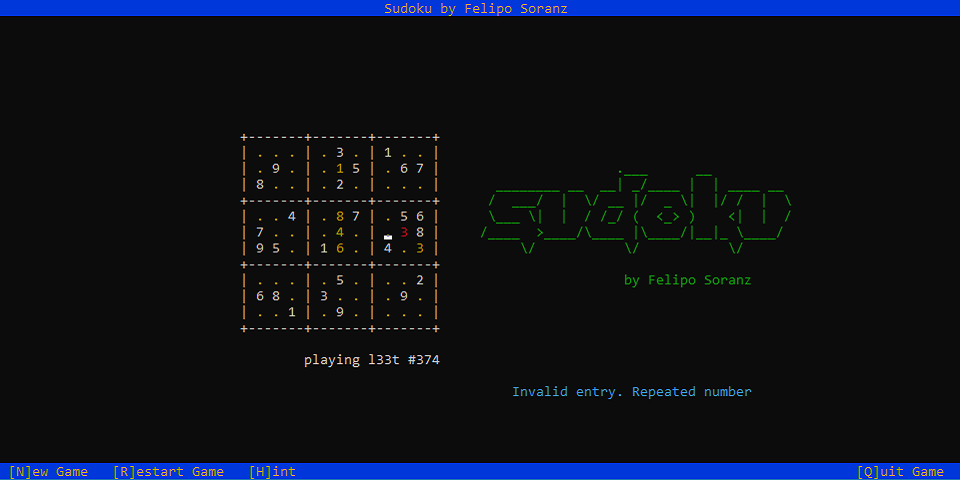

# Sudoku - Harvard CS50

A terminal/console game of Sudoku.



## Project

This is my implementation of the problem set 4 in Harvard's CS50 when I was following the course back in 2011.

For the original files, check [this link](https://cdn.cs50.net/2010/fall/psets/4/).

## Build

To build the project, run: 

```
make
```

> Requires a **GCC** compiler and the **ncurses** library.
> Tested on Linux and on WSL (Windows Subsystem for Linux) on Windows 10. Can probably be compiled with other C compilers with minor adjustments.

## Usage

For the **easier** set of problems, run:

```
./sudoku n00b
```

For the **harder** set of problems, run:

```
./sudoku l33t
```

You may also enter a problem number after `n00b` or `l33t`.